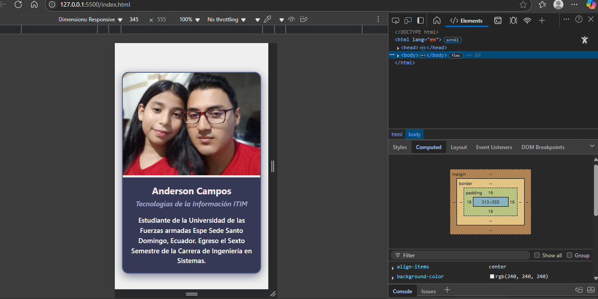
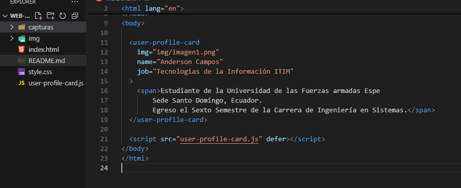

# Tarjeta de Perfil de Usuario - Componente Web Personalizado

---------------------------

En este proyecto desarrollamos un componente web personalizado llamado <user-profile-card>, que muestra una tarjeta de perfil de usuario con:

-Imagen
-Nombre
-Ocupación 
-Breve descripción personalizada

El componente está diseñado para ser reutilizable y flexible, permitiendo que cada usuario adapte el contenido y el estilo mediante atributos y contenido dinámico usando slots.
Crearemos un componente web funcional, visualmente atractivo y semántico, que represente un perfil de usuario con atributos personalizables y contenido dinámico.

-------------------------
 `<user-profile-card>` permite mostrar un perfil con imagen, nombre, ocupación y una breve descripción personalizada usando slot. 
-------------------------

El componente cumple con los requisitos técnicos del examen: uso de clase extendiendo HTMLElement, registro con customElements.define, encapsulación con Shadow DOM y template, atributos personalizados con getAttribute , estilos encapsulados con `:host` y `::slotted`, y uso de al menos un slot.

# Uso del componente
En el archivo index.html, se utiliza el componente con atributos personalizados para mostrar diferentes perfiles.

<user-profile-card
  img="img/imagen1.png"
  name="Anderson Campos"
  job="Tecnologías de la Información ITIN"
>
  Estudiante de la Universidad de las Fuerzas Armadas ESPE Sede Santo Domingo, Ecuador. Egreso el Sexto Semestre de la Carrera de Ingeniería en Sistemas.
</user-profile-card>

### Captura responsiva

### Estructura del código

# Para Finalizar
Uso de clase JavaScript extendiendo de HTMLElement para crear el componente.

Registro del componente con customElements.define.

Uso de Shadow DOM para encapsular la estructura HTML y los estilos, garantizando que no afecten ni sean afectados por el resto de la página.

Uso de atributos personalizados (img, name, job) que permiten definir dinámicamente la información mostrada.

Encapsulación de estilos usando los selectores especiales :host (aplica estilos al componente) y ::slotted (aplica estilos a contenido dinámico externo dentro del slot).

Inclusión de un slot para permitir contenido personalizado en la descripción del perfil.

Diseño responsivo para que la tarjeta se vea bien en diferentes tamaños de pantalla.

Estilos visuales basados en una paleta de colores elegante, con buena legibilidad y contraste.