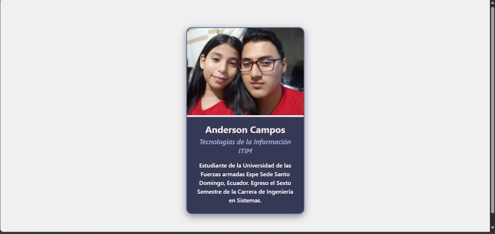

# User Profile Card - Web Component
---------------------------

Crearemos un componente web funcional, visualmente atractivo y semántico, que represente un perfil de usuario con atributos personalizables y contenido dinámico.

-------------------------
Este componente web personalizado `<user-profile-card>` permite mostrar un perfil con imagen, nombre, ocupación y una breve descripción personalizada usando slot. Está diseñado para ser reutilizable y personalizable mediante atributos.
-------------------------
El componente cumple con los requisitos técnicos del examen: uso de clase extendiendo HTMLElement, registro con customElements.define, encapsulación con Shadow DOM y template, atributos personalizados con getAttribute , estilos encapsulados con `:host` y `::slotted`, y uso de al menos un slot.

# Uso del componente
En el archivo index.html, se utiliza el componente con atributos personalizados para mostrar diferentes perfiles.

<user-profile-card
  img="img/imagen1.png"
  name="Anderson Campos"
  job="Tecnologías de la Información ITIN"
>
  Estudiante de la Universidad de las Fuerzas Armadas ESPE Sede Santo Domingo, Ecuador. Egreso el Sexto Semestre de la Carrera de Ingeniería en Sistemas.
</user-profile-card>

### Captura responsiva

### Estructura del código

